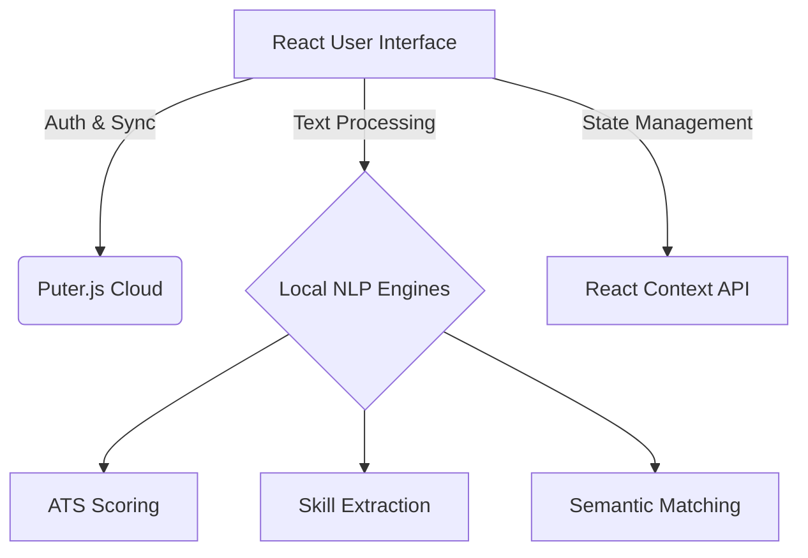

# CareerAI Pro 🚀

A comprehensive, frontend-only AI Career Intelligence Platform built to help professionals transition careers, optimize their resumes, and prepare for interviews using lightweight, local NLP and Puter.js for cloud persistence.

 <!-- Add your Hero screenshot here -->

## 🌟 Features

*   **📊 Dashboard:** A centralized hub to view your overall career transition progress, ATS scores, and saved insights.
*   **🎯 ATS Score Analysis:** Analyzes your resume against target roles to give you an actionable ATS compatibility score.
*   **🧩 Skill Gap Identification:** Highlights missing skills required for your target domain.
*   **💼 Job Match Analysis:** Matches your profile with real-world job roles using semantic NLP matching.
*   **🗺️ Career Roadmap:** Generates dynamic, domain-aware career transition roadmaps with time estimates and actionable milestones.
*   **📝 Resume Improve:** Provides intelligent, line-by-line suggestions to enhance your resume's impact.
*   **💬 AI Mentor:** A conversational AI assistant to answer your career-related questions and provide guidance.
*   **🎤 Interview Prep:** Interactive interview preparation with role-specific questions and feedback.
*   **💻 GitHub Analyzer:** Analyzes your open-source contributions and repository quality.
*   **🔗 LinkedIn Pro:** Optimizes your LinkedIn profile for maximum visibility to recruiters.
*   **✨ Personal Branding:** Helps you build a compelling professional brand and narrative.

## 📸 Screenshots

### Dashboard
 <!-- Add your Dashboard screenshot here -->

### ATS Analysis & Skill Gap
 <!-- Add your ATS/Skill Gap screenshot here -->

### Career Roadmap
 <!-- Add your Career Roadmap screenshot here -->

### AI Mentor & Interview Prep
 <!-- Add your Mentor/Interview screenshot here -->

## 🏗️ System Architecture

CareerAI Pro is built with a **100% Client-Side Architecture**, ensuring low complexity, high performance, and zero reliance on paid external backends or APIs. 

*   **Frontend Framework:** React.js
*   **UI/UX:** Custom CSS with modern glassmorphism, fluid animations (Framer Motion), and responsive design.
*   **Data Persistence & Auth:** [Puter.js](https://puter.com/) is used as a lightweight, drop-in backend-as-a-service for user authentication and cloud-synced storage of career profiles and resumes.
*   **Core Logic Engines:** All NLP (Natural Language Processing), scoring, and matching algorithms are implemented in vanilla JavaScript and run entirely in the browser (e.g., `nlpEngine.js`, `atsEngine.js`, `jobScraperEngine.js`).
*   **Data Visualization:** Recharts for dynamic scoring and progress graphs.
*   **Icons:** Lucide React.



## 🚀 How the App Works

1.  **Authentication:** Users sign in using the Puter.js integration, which securely manages sessions without requiring a dedicated backend server.
2.  **Data Ingestion:** Users input their current resume (text format) and target job role/domain.
3.  **Local Processing:** 
    *   The `nlpEngine.js` tokenizes and normalizes the input text.
    *   Specific engines (like `atsEngine.js` and `skillEngine.js`) run keyword extraction, frequency analysis, and semantic similarity checks against a localized dataset or predefined domain models.
4.  **Insights Generation:** The app computes scores, generates roadmaps, and builds interview questions based entirely on the processed local data.
5.  **Persistence:** Whenever a user updates their profile or generates new insights, the state is automatically synced to their Puter.js cloud storage via `puterService.js`, ensuring their data is available across sessions.

## 🛠️ Installation & Setup

1.  **Clone the repository:**
    ```bash
    git clone https://github.com/Mohnish-140605/CareerAIPRO.git
    cd CareerAIPRO
    ```

2.  **Install dependencies:**
    ```bash
    npm install
    ```

3.  **Start the development server:**
    ```bash
    npm start
    ```
    The app will be available at `http://localhost:3000`.

## 📄 License
MIT License
